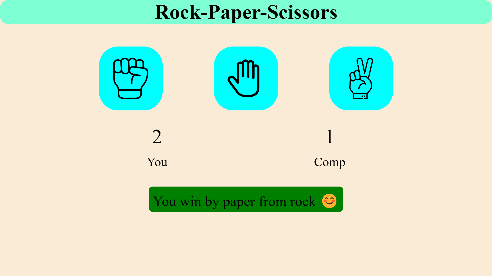

# Rock Paper Scissors Game

A fun and interactive **Rock Paper Scissors** game where you play against a computer. Built using **HTML**, **CSS**, and **JavaScript**, this simple yet classic game will test your luck and strategy!

---

## Key Features:
- **Interactive Gameplay**: Choose between Rock, Paper, or Scissors and battle against the computer.
- **Randomized Computer Moves**: The computer’s choice is randomly generated for fair play.
- **Score Tracking**: Track how many times you win, lose, or draw.
- **Clean and Responsive Design**: The layout is responsive, adjusting to different screen sizes and devices for a seamless experience.

---

## Technology Stack:
- **HTML5**: For creating the structure of the game.
- **CSS3**: For styling the game, making it visually appealing.
- **JavaScript**: For handling the logic of the game and user interaction.

---

## Demo:
Check out the live demo [here](https://ravigitacc87.github.io/Rock-paper-scissor/) and see how many rounds you can win against the computer!

---

## Preview:
Take a sneak peek at the game before you play!



---

## How to Play:
The rules are simple:
- **Rock** beats **Scissors**
- **Scissors** beats **Paper**
- **Paper** beats **Rock**

Choose your move, and the computer will pick a random one. Try to win as many rounds as you can!

---

## How to Run:
1. **Clone this repository** to your local machine:
   ```bash
   git clone <https://ravigitacc87.github.io/Rock-paper-scissor/>
   ```
2. **Open the project**:
   - Navigate to the project folder and open the `index.html` file in your web browser.
   - You can also run a local server like XAMPP or MAMP to view the project in your browser.

3. **Start Playing**: Simply select your move—**Rock**, **Paper**, or **Scissors**—and see if you can beat the computer!

---

## Fun Fact:
Did you know that **Rock Paper Scissors** is an ancient game that originated in China over 2,000 years ago? It was later popularized in Japan before spreading globally!

---

## Future Improvements:
- **Multiplayer Mode**: Add an option for two players to battle it out!
- **Advanced AI**: Implement AI that adapts to the player’s move patterns for a more challenging experience.
- **Leaderboard**: Add a global leaderboard to track top players.

---
